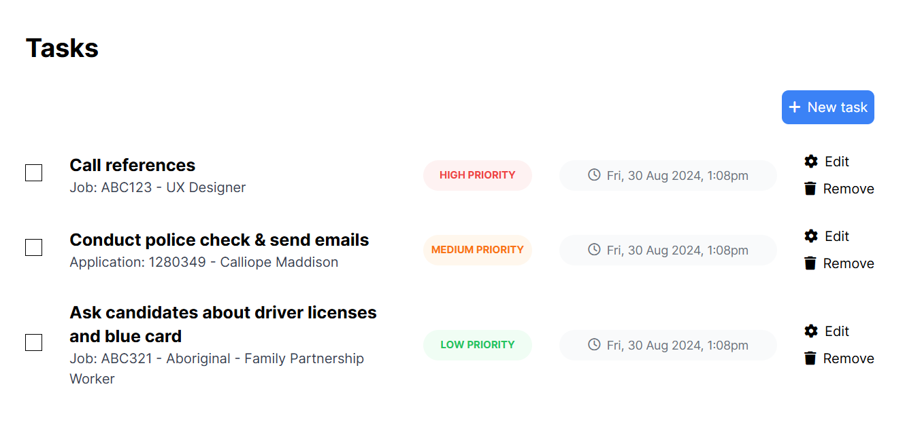

# README

## Description
A to-do list project developed for the NetEngine assignment.

## Tech stack
- Ruby [3.1.2]
- Rails [7.1.4]

## How to run
- Clone the project
- Add your PostgresSQL credentials to `database.yml` file
- Run `bundle install`
- Run `rails db:setup`
- To start local server, run `./bin/dev`
